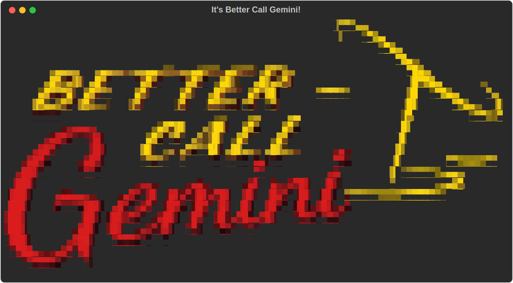

<div align="center">



# ⚖ BetterCallGemini ⚖

**A [Claude Code](https://claude.com/claude-code) skill that gets Google Antigravity's
CLI (`agy`, Gemini) to _criticize_ your codebase — then Claude triages the feedback and
implements it. `agy` only reviews and proposes; it never edits your code or runs anything.**

[](LICENSE)

</div>

---

## 🚀 Let's get the job done

Three steps and you're reviewing code with Gemini from inside Claude Code.

### 1️⃣ Put `agy` to work
Install **[Google Antigravity](https://antigravity.google/)** and make sure its CLI, `agy`, is
on your `PATH`. Log in once and confirm it answers:

```bash
agy                  # complete the Google sign-in in your browser
                     #   (headless / over SSH? run instead:  script -c agy /dev/null )
agy -p 'reply OK'    # should print OK within a few seconds — you're good
```

> **Trouble logging in on a remote machine?** Some people hit authentication issues when running
> `agy` over SSH / on a headless box (the browser sign-in link can be hard to capture). A handy
> workaround is to give `agy` a PTY and tee the session to a file so you can grab the URL:
>
> ```bash
> script -f gemini-login.txt   # opens a recording shell with a real terminal
> agy                          # start agy inside it, then open the printed sign-in link in your browser
> ```
>
> Read the OAuth link out of `gemini-login.txt`, complete it in your browser, then exit the shell.
> ⚠️ That file records the whole session (including OAuth codes) — **delete `gemini-login.txt`
> afterward** (it's already in `.gitignore` so it never gets committed).

### 2️⃣ Put this skill in your Claude
Drop the repo straight into Claude Code's skills folder (the repo root *is* the skill):

```bash
git clone https://github.com/douglasadamoski/BetterCallGemini.git ~/.claude/skills/BetterCallGemini
```

### 3️⃣ That's it — call it
In Claude Code, run the slash command:

```
/BetterCallGemini
```

…or just describe the task and let Claude auto-trigger it:

```
better call gemini on this folder
```

Either way, Claude composes the critique prompt, sends your whole codebase to Gemini's giant
context, brings back a prioritized review, and implements the findings worth keeping — while the
edit-guard makes sure `agy` itself never changed a thing. ✅

---

## Why

Claude is great at writing and changing code, but a second, *independent* model with a
**huge context window** is a powerful critic. BetterCallGemini hands a whole codebase to
Gemini via `agy`, asks for a broad, intent-first critique (no test suite spoon-fed — Gemini
invents the tests it would write), and brings back a prioritized findings report. **Claude**
then decides what's valid and implements it.

The catch: `agy` in headless/print mode **cannot be sandboxed** (no permission flag makes it
read-only — see [`references/agy_notes.md`](references/agy_notes.md)). So "Gemini doesn't touch
your code" is guaranteed **architecturally**, not by configuration:

- **Edit-guard** — the wrapper snapshots every in-scope file before the run and, afterward,
  **restores** anything `agy` changed/deleted and **removes** anything it created (excluding the
  report and an optional sandbox). File↔dir↔symlink type-swaps are handled; out-of-scope symlink
  targets are protected; changes are detected by content hash.
- **Claude is the sole executor** — in sandbox mode `agy` *proposes* scripts; Claude reviews each
  one and runs only the approved ones.
- **`agy` is never run with `--dangerously-skip-permissions`.**

## Two modes

| Mode | What happens |
|------|--------------|
| **A — Critique** (default) | `agy` reads the scope and returns a written, prioritized critique. Claude triages each finding (accept/reject/investigate) and implements the good ones. No conda needed. |
| **B — Sandbox** | `agy` *designs* experiments/tests and writes scripts into a sandbox dir (never your code). Claude reviews each script, then runs the approved ones in a conda env and feeds results back. |

## Requirements

- **[Claude Code](https://claude.com/claude-code)** — this is a skill it loads.
- **`agy`** — Google Antigravity CLI, on your `PATH` and logged in
  (`script -c agy /dev/null`, complete the browser OAuth).
- **Linux** with **`script`** (util-linux) — required to give `agy` a PTY (see below). Not
  portable to macOS/BSD `script` as-is.
- **bash 4+** and coreutils (`sha256sum`, `flock`, `stat`, `readlink -f`).
- **conda** — only for Mode B (running proposed scripts). Configurable env via `--env` /
  `$BCG_CONDA_ENV` (default `base`). Mode A needs no conda.
- **chafa** — only if you want to regenerate the ASCII banner.

> **The PTY gotcha.** `agy -p` for an agentic task **hangs at 0% CPU** when run without a TTY
> (e.g. straight from a tool call). The fix this skill uses is to wrap `agy` in `script`, which
> allocates a pseudo-terminal. This was the single most important discovery in building the skill.

## Install

Claude Code auto-discovers skills under `~/.claude/skills/`. Clone the repo directly as the
skill folder:

```bash
git clone https://github.com/douglasadamoski/BetterCallGemini.git ~/.claude/skills/BetterCallGemini
```

(or copy the folder there). That's it — no build step. Then in Claude Code:

```
/BetterCallGemini
```

or just say *"better call gemini on this folder"* / *"have gemini criticize this code"*.

## Usage

Once installed, you drive it through Claude Code in natural language — Claude composes the
intent description, runs the wrapper, and triages the results for you. Under the hood it calls:

```bash
# Mode A — critique
scripts/agy_review.sh \
  --prompt-file <prompt.md> \
  --out PROJECT/BETTERCALLGEMINI_REVIEW_<ts>.md \
  --scope <dir> [--scope ...] \
  --model "Gemini 3.1 Pro (High)" --cap 5
```

The script's last stdout line is `RESULT=<OK|AUTH|CAP|QUOTA|TIMEOUT|ERROR>` so Claude can branch
(e.g. **stop and wait** on quota/throttle rather than hammering the API).

### Quota

There is no programmatic quota readout for `agy`, so the skill tracks usage best-effort: a daily
**call cap** (`--cap`, default 5) and an append-only ledger at `state/usage.jsonl`. On a
quota/rate-limit error — or a throttle-induced timeout — it **stops and tells you to wait** for
the reset.

## Layout

```
SKILL.md                 # how Claude orchestrates the skill (the "brain")
scripts/
  agy_review.sh          # entrypoint: one agy turn (critique or sandbox) + edit-guard + ledger
  _agy_common.sh         # shared lib: edit-guard, PTY runner, quota ledger, classification
  run_in_sandbox.sh      # Claude runs an approved script, confined to the sandbox dir
  show_header.sh         # the colored banner header
templates/
  critique_prompt.md     # Mode A prompt template
  sandbox_prompt.md      # Mode B prompt template
references/
  agy_notes.md           # hard-won agy knowledge: flags, paths, error strings, the PTY fix
assets/                  # banner art
state/                   # runtime ledger + guard stashes (gitignored)
```

## Configuration

| Knob | Where | Default |
|------|-------|---------|
| Model | `--model` | `Gemini 3.1 Pro (High)` |
| Daily call cap | `--cap` | `5` |
| Sandbox conda env | `--env` / `$BCG_CONDA_ENV` | `base` |
| agy print timeout / wrapper timeout | `$BCG_PRINT_TIMEOUT` / `$BCG_TIMEOUT` | see `_agy_common.sh` |

## Safety notes

- `run_in_sandbox.sh` is **not** a security jail — it only verifies the script lives under the
  sandbox dir and runs it with your normal privileges. **The Claude review gate is the real
  boundary**: never run an unreviewed `agy`-proposed script.
- The edit-guard's mode-only-change detection and parallel-same-scope handling are best-effort;
  see the "documented limitations" in [`references/agy_notes.md`](references/agy_notes.md).

## License

[GPL-3.0](LICENSE) © 2026 Douglas Adamoski.
